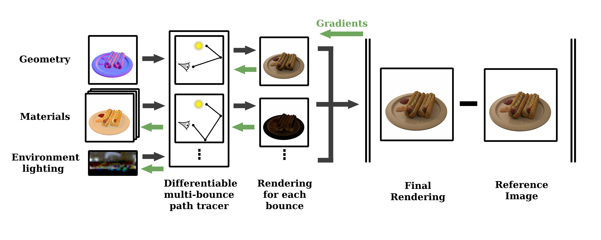
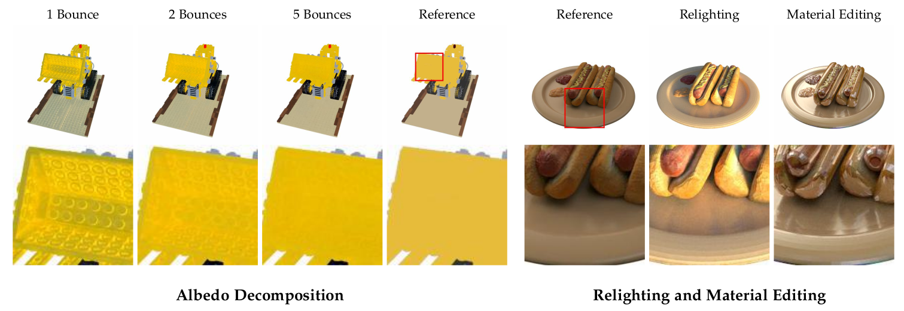

# neural-inverse-rendering
### [Project Page](https://yuechengithub.github.io/neural-inverse-rendering/) | [Thesis](./docs/MA_Yue_Chen.pdf)
<br>

[Neural Scene Decomposition for Accurate Light and Material Reconstruction via Physically-Based Global Illumination Estimation](https://yuechengithub.github.io/neural-inverse-rendering/)
<br>
[Yue Chen](https://github.com/YueChenGithub)<sup>1</sup>, [Peter Kocsis](https://peter-kocsis.github.io/)<sup>1</sup>, [Matthias Niessner](https://www.niessnerlab.org/)<sup>1</sup>
<br>
<sup>1</sup>Technical University of Munich






_Abstract: Recent advances in neural rendering have achieved pinpoint reconstruction of 3D scenes from multi-view images. To enable scene editing under different lighting conditions, an increasing number of methods are integrating differentiable surface rendering into the pipelines. However, many of these methods rely heavily on simplified surface rendering algorithms, while considering primarily direct lighting or fixed indirect illumination only. We introduce a more realistic rendering pipeline that embraces **multi-bounce Monte-Carlo path tracing**. Benefiting from the multi-bounce light path estimation, our method can decompose high-quality material properties without necessitating additional prior knowledge. Additionally, our model can accurately estimate and reconstruct secondary shading effects, such as indirect illumination and self-reflection. We demonstrate the advantages of our model to baseline methods qualitatively and quantitatively across synthetic and real-world scenes._

## Setup

We suggest install the environment using conda:

```
# Create a new environment
conda create -n ma python=3.8
conda activate ma

# Install PyTorch
pip install torch==1.13.0+cu117 torchvision==0.14.0+cu117 torchaudio==0.13.0 --extra-index-url https://download.pytorch.org/whl/cu117
pip install pytorch-lightning==1.7.7

# Install Mitsuba
pip install mitsuba==3.0.2 drjit==0.2.2

# Install other dependencies
pip install wandb==0.13.5 lpips==0.1.4 imageio-ffmpeg==0.4.8 torchmetrics==0.11.2

# Install TinyCudaNN
conda install conda-forge::cudatoolkit-dev
pip install git+https://github.com/NVlabs/tiny-cuda-nn/#subdirectory=bindings/torch
```

## Data

### Light Probes
Download the light probes from [here](https://drive.google.com/file/d/1Y75w5xd6MWsUrIrcKSlEoXOQ4VJXLBhn/view?usp=sharing) and put them in `./light_probe`.

### Datasets
Download the NeRFactor-Synthetic dataset from [here](https://drive.google.com/drive/folders/1wTX6RuifMCe2xvyk00dlBSsKxO_vuwlp) and put them in `./dataset/nerfactor/`.
<br>
Download the TensoIR-Synthetic dataset from [here](https://zenodo.org/records/7880113#.ZE68FHZBz18) and put them in `./dataset/tensoir/`.
<br>
Download the (modified) DTU/MonoSDF dataset from [here](https://drive.google.com/file/d/1iLXvPAAs0CyF4EzbpoPK--308xH_E76m/view?usp=sharing) and put them in `./dataset/monosdf/`.


### Meshes

We provide GT meshes and estimated meshes, you can download them from [here](https://drive.google.com/file/d/1fBdrd4_1ogzvAfutkPOYL_j_brlxNEoW/view?usp=sharing) and put them in `./dataset/mesh/`.

The estimated meshes for synthetic dataset are generated by TensoIR, and the estimated meshes for real world dataset are generated by MonoSDF.

## Running code

```
python run.py
```

We provide configs responsible for the thesis results in `./config/`, you can change the config in `run.py`:
```
configs = ['./config/dtu/lego_3072.ini']
```


## Acknowledgements

The code for multiple importance sampling rendering and BRDFs are based on [Mitsuba](https://www.mitsuba-renderer.org/) and the excellent [pbr book](https://www.pbr-book.org/).
<br>
The datasets are from [NeRFactor](https://github.com/google/nerfactor), [TensoIR](https://github.com/Haian-Jin/TensoIR), and [DTU](https://roboimagedata.compute.dtu.dk/?page_id=36). The estimated meshes are from [TensoIR](https://github.com/Haian-Jin/TensoIR) and [MonoSDF](https://github.com/autonomousvision/monosdf).
<br>
We thank all the authors for their great work.
